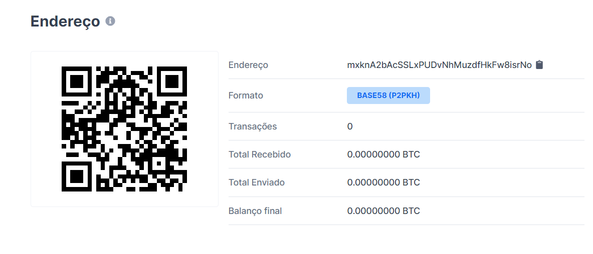
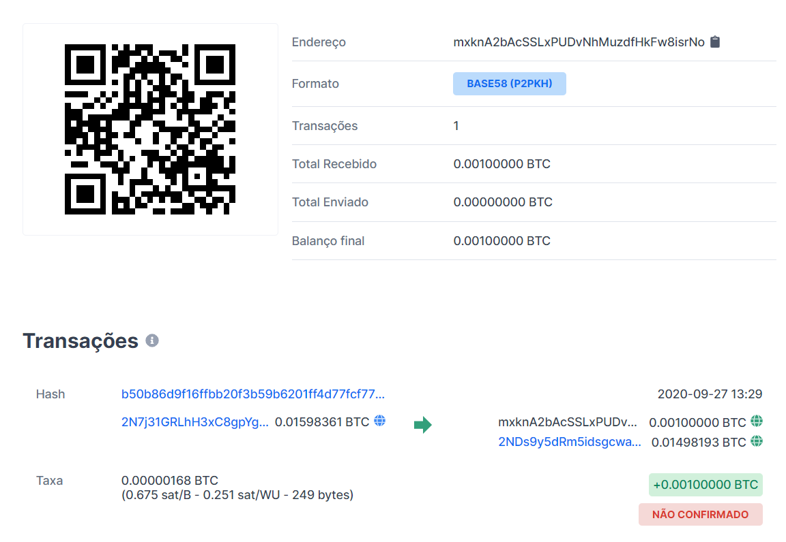
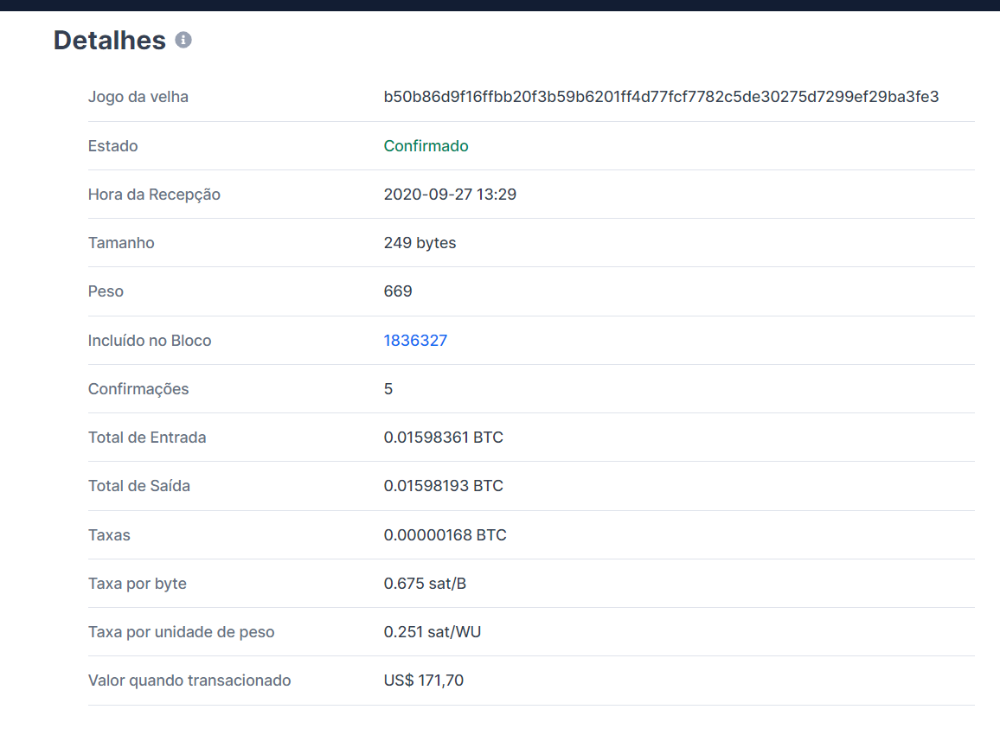
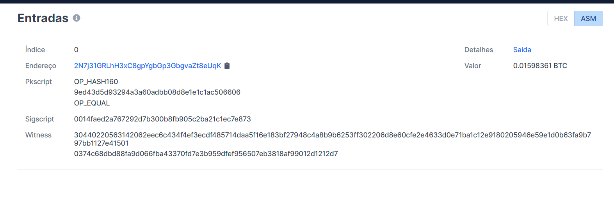
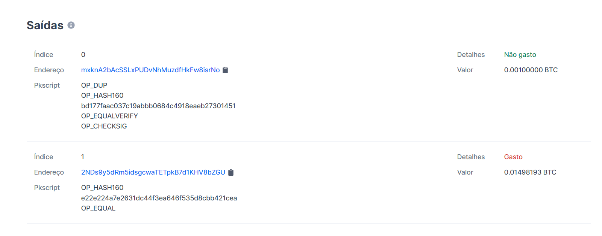

## Geração da cateira
Utilizei o pacote NBitcoin com c# para gerar a wallet

* publicKey: `0382d926256cee53a94ff3e2ffc882de17f45209ac1b93150b14d53efdb80b10c5`
* address: `mxknA2bAcSSLxPUDvNhMuzdfHkFw8isrNo`
* privateKey: `Kx8Bivqvyb8nR4HcsxZXkxfGiY4eckZnXuqzZjtt2EvMRdyryr1T`



## Depósito:
O faceut do slide não funcionou, pelo menos não comigo então para o despósito foi utilizado o `https://testnet-faucet.mempool.co`

```
Transaction sent

TxID: b50b86d9f16ffbb20f3b59b6201ff4d77fcf7782c5de30275d7299ef29ba3fe3
Address: mxknA2bAcSSLxPUDvNhMuzdfHkFw8isrNo
Amount: 0.001
```









Tentei rodar o código ruby dos slides mas não consegui ;-;
